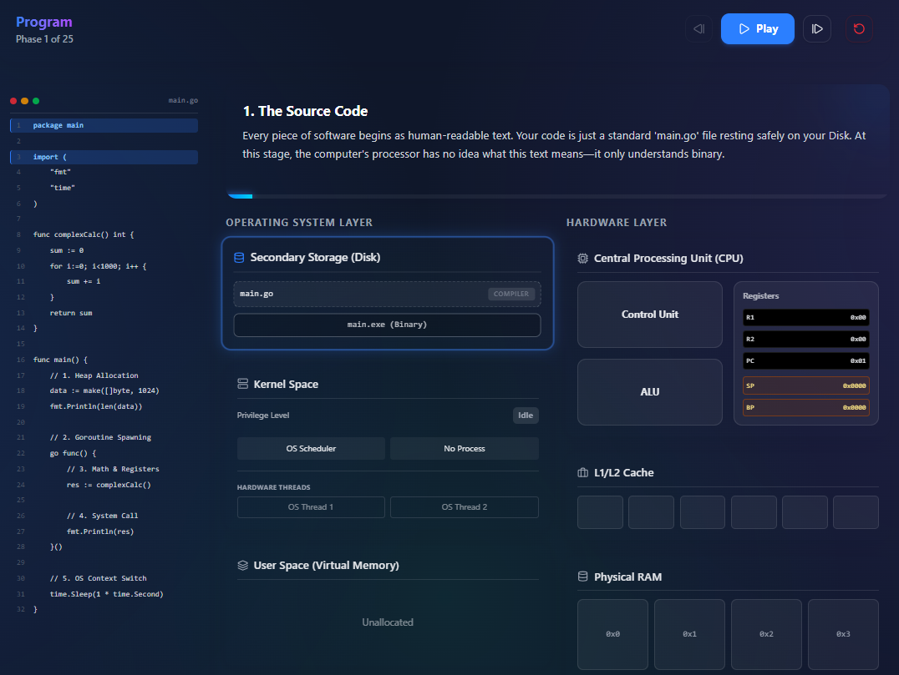

# Execution Journey Simulator 🚀

**Execution Journey** (also known as Connect the Dots) is an interactive, visual simulator built to demystify the lifecycle of a computer program. 

It takes you step-by-step through a 25-phase execution of a Go program, visually mapping how code on disk gets loaded into memory, executed by the CPU, managed by the Operating System, and eventually context-switched.

 *(Note: Add a screenshot of your app here!)*

## 🌟 Features

- **Interactive Execution Timeline**: Step forwards, backwards, or auto-play through 25 distinct phases of program execution.
- **Synchronized Code Viewer**: Watch exactly which line of Go code is executing during each phase.
- **Hardware Architecture Visualization**: Real-time visual feedback on the state of the CPU, Registers, ALU, L1/L2 Cache, and Physical RAM.
- **OS Layer Visualization**: Understand the boundaries between Kernel Space and User Space, and watch memory get allocated in the Heap and Stack.
- **Concurrency & Goroutines**: See how the Go runtime spawns and manages Goroutines before the OS performs a context switch.
- **Theoretical Concepts Library**: A dedicated `/learn` section with a Journey Map that breaks down the theoretical computer science concepts (like virtual memory, FDE cycles, and system calls) powering the simulation.

## 🛠️ Tech Stack

This project is built with modern, cutting-edge web technologies:
- **[Next.js 15+](https://nextjs.org/)** (App Router) - React Framework
- **[React 19](https://react.dev/)** - UI Library
- **[Tailwind CSS 4](https://tailwindcss.com/)** - Utility-first CSS framework for styling
- **[Framer Motion](https://www.framer.com/motion/)** - Smooth, complex animations and UI transitions
- **[Lucide React](https://lucide.dev/)** - Beautiful, consistent iconography
- **TypeScript** - For type safety and better developer experience

## 🚀 Getting Started

To run this project locally, follow these steps:

### Prerequisites
Make sure you have [Node.js](https://nodejs.org/) installed on your machine.

### Installation

1. Clone the repository:
   ```bash
   git clone https://github.com/rukonbdju/connect-the-dots.git
   cd connect-the-dots
   ```

2. Install the dependencies:
   ```bash
   npm install
   ```

3. Start the development server:
   ```bash
   npm run dev
   ```

4. Open [http://localhost:3000](http://localhost:3000) with your browser to see the simulator in action!

## 🌐 Deployment

This project is optimized for deployment on [Vercel](https://vercel.com). 

You can easily deploy it by importing your GitHub repository into Vercel, or by using the Vercel CLI:
```bash
npm i -g vercel
vercel
```

## 🧠 Educational Goals
This simulator was created to help students, junior developers, and tech enthusiasts visualize the invisible layers of computer science. By "connecting the dots" between high-level code and low-level hardware/OS execution, users can build a stronger mental model of how software actually runs.
